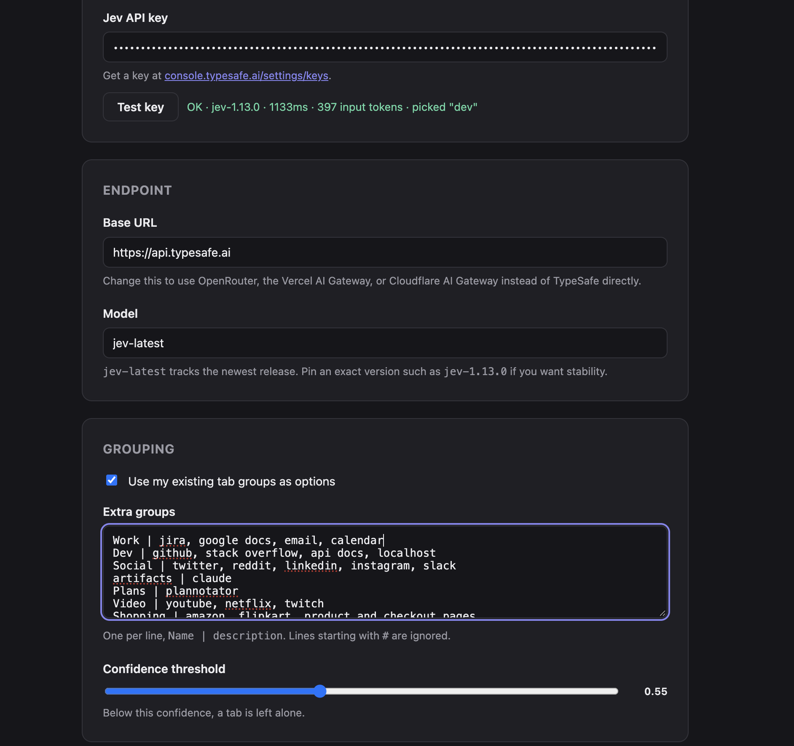

# TabJev

Every new tab sorts itself into the right Chrome group, for roughly a cent a
month. Runs on [Jev](https://typesafe.ai) (TypeSafe). Bring your own key.



A real Test key call against `jev-1.13.0`: one tab classified from 397 input
tokens, answer `dev`. That reading is `1133 ms` because it is a cold call, and
it pays for the service worker spinning up and a fresh TLS handshake on top of
the model itself. Warm calls in the decision log settle far below that. Both
numbers are visible to you in the options page, so you never have to take
this paragraph's word for it.

<!-- demo.gif goes here: record at 1280x800, opening 3-4 tabs into existing groups -->

## Why this is not another LLM tab grouper

Jev doesn't generate text. It answers a typed `choice` question — "which of
these groups does this tab belong to" — and returns the choice with a
calibrated probability. A chat-completion model doing the same job has to
generate a token stream and get parsed back into a decision: 2 to 30 seconds
and a cent or more per call, which is why every other AI tab organizer runs
behind a button, not on every tab.

Jev's per-tab request carries a URL and a title, nothing else, and prices
input at `PRICE_PER_MTOK = 0.042` dollars per million tokens (`lib.js`),
output free. At roughly 250 input tokens for one tab's URL and title, that's
about `250 / 1e6 * 0.042 ≈ $0.00001` per tab. Open a thousand new tabs in a
month and you've spent about a cent. That gap — cents instead of dollars,
milliseconds instead of seconds — is the whole reason grouping can run on
*every* tab open instead of behind a button.

## Install

There is no Chrome Web Store listing. This is a load-unpacked extension:

1. Download the zip from [Releases](https://github.com/rishhavv/tabjev/releases) and unzip it.
2. Open `chrome://extensions`, turn on Developer mode (top right).
3. Click "Load unpacked" and select the unzipped folder.

Chrome will show a "disable developer mode extensions" nag on every browser
launch. That's the honest cost of not being on the Web Store — there is
nothing in this extension that removes it.

## Set up your key

1. Sign up at [console.typesafe.ai](https://console.typesafe.ai). New accounts
   start with $5 of credit.
2. Create a key at [console.typesafe.ai/settings/keys](https://console.typesafe.ai/settings/keys).
3. Open the extension's options page, paste the key into "Jev API key", and
   click "Test key".

The default endpoint is `https://api.typesafe.ai`. If you'd rather route
through OpenRouter, the Vercel AI Gateway, or Cloudflare AI Gateway, change
the "Base URL" field — the extension will ask Chrome for permission to reach
that host the first time you point it somewhere other than TypeSafe.

## How it works

- A tab finishes loading and Chrome reports it as ungrouped.
- The worker waits 800 ms (debounced), then re-checks the tab is still
  ungrouped, unpinned, and `http`/`https`.
- If "use existing groups" is on, it collects your current tab groups and
  describes each one using up to three tabs already in it.
- It sends Jev one `choice` question per tab: the existing groups plus any
  rules you've written, plus `none`, as the options.
- `none` is listed first on purpose — Jev's documented quirk is that the
  first-listed option in a choice question is under-picked, so `none` gets
  that seat to keep it from starving.
- If the returned probability clears your confidence threshold, the tab is
  moved into that group (existing group, or a newly created one for a rule).
  Below threshold, the tab is left alone.

The actual request body, as `buildRequest` in `lib.js` produces it:

```json
{
  "model": "jev-latest",
  "state": [
    { "id": 42, "url": "https://github.com/rishhavv/tabjev", "title": "tabjev: auto tab groups" }
  ],
  "questions": {
    "t42": {
      "type": "choice",
      "instructions": "Tab 42 in the list above: which group does this browser tab belong in? Judge by the site and the page title. Answer none when it does not clearly fit.",
      "criteria": {
        "none": "Does not clearly belong to any listed group",
        "dev": "Code, repositories, documentation"
      }
    }
  }
}
```

## What it sends

| Data | Where it goes |
|---|---|
| Page URL and title of each ungrouped `http`/`https` tab | Only the endpoint you configured (default `https://api.typesafe.ai`) |
| Titles and up to 3 example tabs of your existing tab groups | Same endpoint, to describe the grouping options to Jev |

What never leaves: your API key. It's stored in `chrome.storage.local`, never
`chrome.storage.sync`, so it never syncs to a Google account and never
travels anywhere but the outgoing request's `Authorization` header. There is
no telemetry, no analytics, and no server run by this project — requests go
straight from your browser to whichever endpoint you configured.

"Strip query strings and hashes" defaults to on (`stripQuery: true` in
`lib.js`). A URL's query string can carry a session token or other sensitive
parameter; with this on, only the origin and path are sent.

## Options

Defaults and behavior are read straight out of `DEFAULTS` in `lib.js`.

| Setting | Default | Purpose |
|---|---|---|
| `apiKey` | `""` | Your Jev API key. Empty disables classification entirely. |
| `baseUrl` | `https://api.typesafe.ai` | Endpoint that receives the classification request. Change it to route through OpenRouter or a gateway. |
| `model` | `jev-latest` | Model name sent in each request. |
| `useExisting` | `true` | Include your current tab groups as options Jev can pick from. |
| `rules` | six seeded lines: `Work`, `Dev`, `Social`, `Video`, `Shopping`, `Reading` (see `DEFAULT_RULES` in `lib.js`) | Extra groups as `name \| description` lines, one per group, for tabs that don't fit an existing group. |
| `threshold` | `0.55` | Minimum probability required before a tab is moved. Below it, the tab is left ungrouped. |
| `stripQuery` | `true` | Strip the query string and hash from a URL before it's sent. |
| `groupOnStartup` | `false` | Classify every ungrouped tab in every window when Chrome starts. |
| `allowIncognito` | `false` | Also classify tabs in incognito windows. |
| `enabled` | `true` | Master switch. Chrome sets this to `false` automatically if the API rejects your key (401/403). |

## Development

```
node --test test.mjs
```

File layout:

```
lib.js          pure logic: no chrome.* calls, shared by background.js, options.js and tests
background.js   MV3 service worker: listens for tabs, calls Jev, moves tabs into groups
options.html    settings page markup
options.js      settings page logic, key testing, decision log
```

No build step, no dependencies, no bundler. Load the folder as-is.

## Known limits

- Jev's first-listed choice option is under-picked; `none` is listed first in
  every request to absorb that bias rather than let it starve a real group.
- Only `http`/`https` tabs are ever classified — new-tab pages, `chrome://`
  pages, PDFs opened as `file://`, and extension pages are skipped.
- A tab opened from a link inside a grouped tab inherits that tab's group
  from Chrome itself before TabJev ever sees it, so it's never classified.
- The MV3 service worker is unloaded when idle. The first tab you open after
  a pause pays a cold start while the worker restarts.
- There is no Chrome Web Store build. Every install is load-unpacked, with
  the Developer Mode warning that comes with it.

## Licence

MIT — see [LICENSE](LICENSE). This project is not affiliated with, endorsed
by, or sponsored by TypeSafe.

See also: [PRIVACY.md](PRIVACY.md).
